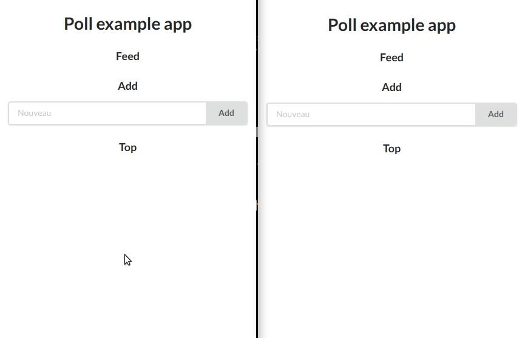

# Idea suggestion & vote app

Simple app written as an experiment with Go & Svelte leveraging server-sent events and reactivity.



## Features 
- Suggest new ideas in real-time
- Voting with real-time updates
- Responsive

## Requirements

- docker
- npm

Set a postgres password in an environment variable for docker.

`export POSTGRES_PASSWORD=secret`

## Building

```
cd client && npm i && npm run build
docker-compose up -d
```

## Development setup

Building the frontend

```cd client
npm i
npm run autobuild  # the client is live-reload enabled
```

Running the backend: see Dockerfile if you want to run it without Docker.